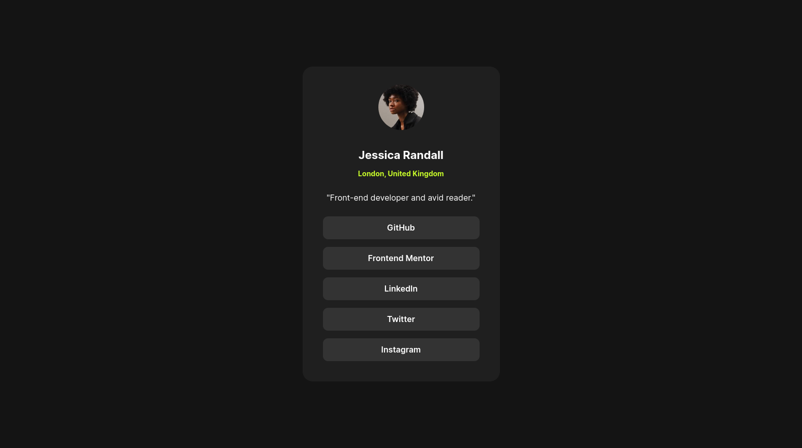
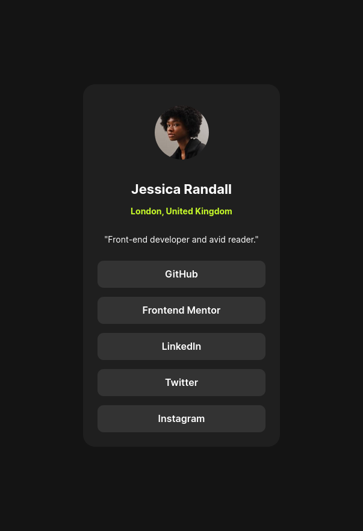

# Frontend Mentor - Blog preview card solution

This is a solution to the [Blog preview card challenge on Frontend Mentor](https://www.frontendmentor.io/challenges/blog-preview-card-ckPaj01IcS). Frontend Mentor challenges help you improve your coding skills by building realistic projects. 

## Table of contents

- [Frontend Mentor - Blog preview card solution](#frontend-mentor---blog-preview-card-solution)
  - [Table of contents](#table-of-contents)
  - [Overview](#overview)
    - [The challenge](#the-challenge)
    - [Screenshot](#screenshot)
      - [Desktop: 1440px](#desktop-1440px)
      - [Mobile: 375px](#mobile-375px)
    - [Links](#links)
  - [My process](#my-process)
    - [Built with](#built-with)
    - [What I learned](#what-i-learned)
  - [Author](#author)


## Overview
Preview card from a blog, where I use HTML and CSS

### The challenge

This is a challenge where you put into practice topics such as background color, importing a font, font sizes, alignment, margins, padding and element sizes, all stylized from a CSS file.

### Screenshot


#### Desktop: 1440px 



#### Mobile: 375px



### Links

- Solution URL: [Add solution URL here](https://github.com/IngLeonardo/socialLinksProfile)
- Live Site URL: [Add live site URL here](https://ingleonardo.github.io/socialLinksProfile/)


## My process

### Built with

- Semantic HTML5 markup
- CSS custom properties
- Flexbox


### What I learned

For this challenge I used Flexbox and I liked to understand that at the end most of the properties are assigned to the parent container.

Let's look at a small piece of code:

```html
<main class="flex-container">
</main>
```
```css
.flex-container{
  display: flex;
  flex-direction: column;
  align-items: start;
}
```

## Author

- Frontend Mentor - [@IngLeonardo](https://www.frontendmentor.io/profile/IngLeonardo)
- Linkedin - [@leonardo-silva](https://www.linkedin.com/in/leonardo-silva-915974220/)

